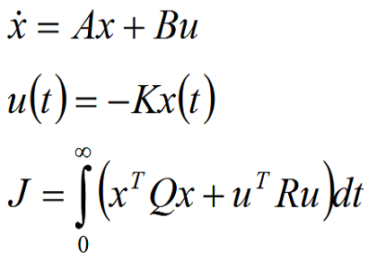
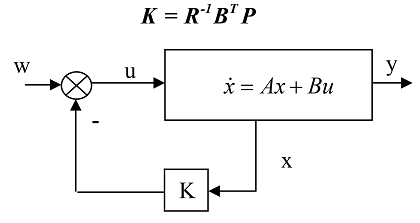

# 1.1 Ball beam math


# 1.2 LQR




# 1.3 LQR loop control



# 1.4 Riccati solution


ARE : Algebraic Riccati Equation (P_dot = 0)


```python
import numpy as np
from control.matlab import *

A = np.array([[0, 1, 0, 0],
              [0, 0, -6.7915, 0],
              [0, 0, 0, 1],
              [-19.62, 0, 0, 0]])
B = np.array([[0, 0, 0, 20]]).T
Q = np.array([[1, 0, 0, 0],
              [0, 1, 0, 0],
              [0, 0, 1, 0],
              [0, 0, 0, 1]])
R = np.array([10])
K, S, E = lqr(A, B, Q, R)   

print("K = ", K)
# print(S)
# print(E)
```
```cmd
K  = [[-2.01170898 -0.92234359  2.4732972   0.58934686]]
```

```
u(t) = -K.x(t)
```

